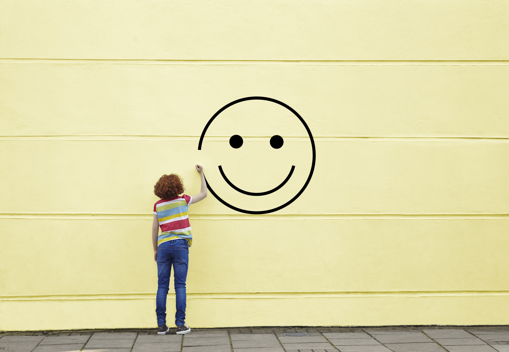

\s \s
Happiness is a vague concept. From the ancient Greeks, there has been great debate about the concept of happiness and what it entails in regards to pleasure. For everybody, what happiness constitutes of and how to achieve it is different. However, as we live in a highly interconnected society, we share many values that contribute to it -- spending time with your friends and family, eating good food, and achieving your dreams.

Happiness is often described as "the experiece of joy, contentment, or positive well-being, combined with a sense that one's life is good, meaningful, and worthwhile."

As the above definition shows, It's hard to grasp what happiness is and to understand what causes it because it is dependent on goals and values.

With the HappyDB, a corpus of 100,000 crowdsourced happy moments, we investigate concretely how the people today express and describe their experiences and meanings of happiness.


```{r Loading libraries, warning=FALSE, message=FALSE}
library("rvest")
library("tibble")
library("tidyverse")
library("qdap")
library("sentimentr")
library("dplyr")
library("tm")
library("syuzhet")
library("factoextra")
library("beeswarm")
library("scales")
library("RColorBrewer")
library("RANN")
library("tm")
library("topicmodels")
library("ngram")
library("ggplot2")
library("DT")
library("tidytext")
library("gridExtra")
```

```{r Loading data, warning=FALSE, message=FALSE}
hm_data <- read_csv("../output/processed_moments.csv")
```

#What kind of emotions factor into happy moments?

```{r Sentimental analysis}
hm_data_sel <- hm_data[sample(nrow(hm_data), 10000), ]
n <- nrow(hm_data_sel)

hm.sentiment <- NULL
hm.sentiment <- data.frame(original_hm=rep("", n), cleaned_hm=rep("", n), text=rep("", n), anger=rep(NA, n), anticipation=rep(NA, n), disgust=rep(NA, n), fear=rep(NA, n), joy=rep(NA, n), sadness=rep(NA, n), surprise=rep(NA, n), trust=rep(NA, n), negative=rep(NA, n), positive=rep(NA, n), stringsAsFactors=FALSE)

for (i in 1:n) {
  text <- hm_data_sel$text[i]
  emotions <- get_nrc_sentiment(text)
  hm.sentiment[i, ] <- c(hm_data_sel$original_hm[i],
                         hm_data_sel$cleaned_hm[i],
                         text,
                         emotions)
}
```


```{r Plotting sentiments, warning=FALSE, message=FALSE}
total.sum <- sum(hm.sentiment$anger, hm.sentiment$anticipation, hm.sentiment$disgust, hm.sentiment$fear, hm.sentiment$joy, hm.sentiment$sadness, hm.sentiment$surprise, hm.sentiment$trust)

sentiment_p <- function(x) {
  return(x / total.sum)
}

sentiment.props <- c(sum(hm.sentiment$anger), sum(hm.sentiment$anticipation), sum(hm.sentiment$disgust), sum(hm.sentiment$fear), sum(hm.sentiment$joy), sum(hm.sentiment$sadness), sum(hm.sentiment$surprise), sum(hm.sentiment$trust))
sentiment.props <- sapply(sentiment.props, sentiment_p)
emotions <- c("anger", "anticipation", "disgust", "fear", "joy", "sadness", "surprise", "trust")
sentiment.df <- data.frame(emotions=emotions, sentiment.props=sentiment.props)
ggplot(sentiment.df, aes(x=emotions, y=sentiment.props, fill=emotions)) + geom_bar(stat="identity") + xlab("Emotions") + ylab("Sentiment Proportions") + ggtitle("Sentiment Proportions from Happy Moments")

```

After conducting sentiment analysis on the happy moments and reviewing the plot above, we can see the positive emotions like 'anticipation,' 'joy,' and 'trust' are significantly more present. This easily confirms that the happy moments people have described are indeed filled by positive emotions.

However, what is kind of surprising is the emotion of 'surprise.' Especially because the emotion of 'surprise' could be a double-edged sword, I initially hypothesized it wouldn't be highlighted as much in the data. However, this sentiment analysis shows otherwise.

This 'surprise' emotion especially complements the event of 'birthday party' that people commonly referred to in their happy moments, which will be later explained the next analysis.

#What kinds of experiences, feelings, or events do people cite in happy moments?

```{r Creating bag of words, warning=FALSE, message=FALSE}
bag_of_words <-  hm_data %>%
  unnest_tokens(word, text)

word_count <- bag_of_words %>%
  count(word, sort = TRUE)

ggplot(data=word_count[1:10,], aes(x=word, y=n, fill=word)) + geom_bar(stat="identity", width=0.5) + coord_flip()

```
The above plot of the word frequencies for the top 10 most frequently words in people's description of happy moments places 'friend,' 'day,' 'time,' 'family,' 'watched,' 'home,' 'played,' 'feel,' 'finally,' and 'found.' Out of these, 'home' tells us where we feel happy most. 'friend,' 'family,' and 'time' indicate whom we place in our happy moments: friends and famil. 'played' and 'watched' indicate what we do in them. 

To get a broader view of the description, we can look at the visualization of the word-cloud on top. Then, we notice the themes of friends, family, love, food, and watching or playing something. 

Both of these visualizations of unigrams picture the dominant experiences that people cited as their happy moments shared the notions of spending time with friends and family and watching or playing something.

# Do reflection periods make a difference in how people reflect on happy moments?
```{r Comparing unigrams in different reflection periods, warning=FALSE, message=FALSE}
bag_of_words_24 <-  hm_data[hm_data$reflection_period == "24h",] %>%
  unnest_tokens(word, text)

bag_of_words_3 <- hm_data[hm_data$reflection_period != "24h",] %>%
  unnest_tokens(word, text)

word_count_24 <- bag_of_words_24 %>%
  count(word, sort = TRUE)

word_count_3 <- bag_of_words_3 %>%
  count(word, sort = TRUE)

p1 <- ggplot(data=word_count_24[1:10,], aes(x=reorder(word, n), y=n, fill=word)) + geom_bar(stat="identity", width=0.5) + coord_flip() + ylab("Frequency") + xlab("Word (24h)")
p2 <- ggplot(data=word_count_3[1:10,], aes(x=reorder(word, n), y=n, fill=word)) + geom_bar(stat="identity", width=0.5) + coord_flip() + ylab("Frequency") + xlab("Word (3m)")

grid.arrange(p1, p2, nrow=1)

```
When we compare the top 10 unigram word frequencies on the reflection period (24 hours or 3 months), we can see clear difference in actions/objects: 'watched,' 'dinner,' and 'morning' are uniquely present in the 24-hour reflection period, whereas 'family,' 'job,' and 'found' are uniquely present in the 3-month reflection period.

Based on the above plots, it seems that, depending on the reflection periods, people can reflect on their happy moments in different ways. More specifically, the shorter reflection period may cause people to look back on immediate events. Suggested by the key words like 'watched,' 'dinner,' and 'morning', these unigrams illustrate actions or events occurred recently in their daily lives. On the other hand, the longer reflection period may cause people to reflect on more abstract values, such as 'job,' 'family,' and 'found.'

# A closer look at happy experiences, feelings, and events
```{r Creating bigrams, warning=FALSE, message=FALSE}
hm_bigrams <- hm_data %>%
  unnest_tokens(bigram, text, token = "ngrams", n = 2)

bigram_counts <- hm_bigrams %>%
  separate(bigram, c("word1", "word2"), sep = " ") %>%
  count(word1, word2, sort = TRUE)

bigram_counts <- na.omit(bigram_counts)
bigram_counts$bigram <- paste(bigram_counts$word1, bigram_counts$word2, sep=" ")

ggplot(data=bigram_counts[1:10,], aes(x=bigram, y=n, fill=bigram)) + geom_bar(stat="identity", width=0.5) + coord_flip() + ylab("Frequency") + xlab("Bigram")
```

Now, we can create pairs of words from every adjacent word in the text, also known as bigrams. With the word frequency of these bigrams, we can relatively get a more detailed look at what kinds of activities, feelings, or experiences people refer to as happy moments.

As the plot above illustrates, the verbs of 'watched' and 'played' are commonly paired with 'movies' and 'game' respectively. Therefore, we can clearly identify that watching movies and playing videos are the most frequently cited activities that people think of as happy moments.

#Conclusion

Through the investigation and analysis of the HappyDB corpus, we can conclude with these following interesting trends/patterns:

1. Surprise is often a positive emotion that people cite in their happy moments. Although it could be a double-edged sword, in this context of happy moments, it seems to dominantly be a positive one.

2. Playing games, watching movies, birthday, and mother seem to be common experiences that people believe to be their daily happy moments.

3. Depending on the length of the reflection period, the descriptors and events for the happy moments could change. More specifically, it seems that the longer the reflection period, the more abstract values to which people cite their happiness.

